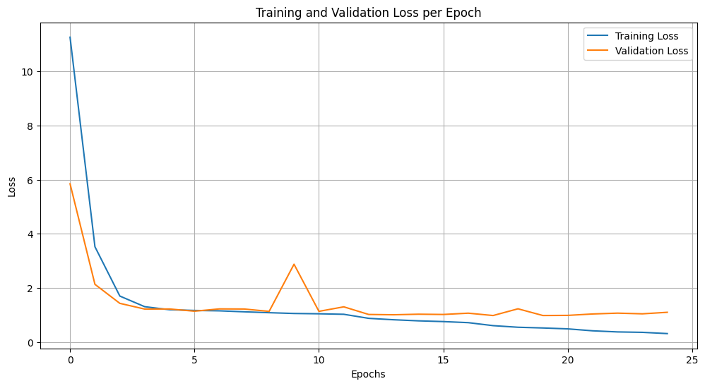
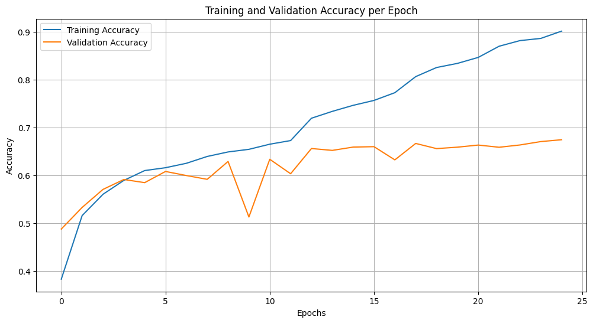
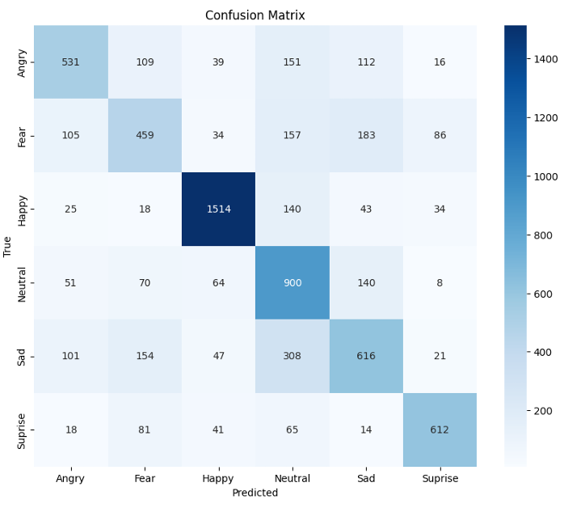
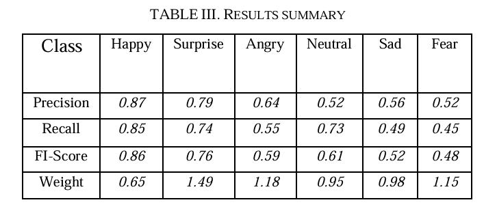

# Facial Emotion Recognition Using Transfer Learning with Xception (ICICS 2025)

This repository contains the implementation and experiments for the published paper:

📄 **Facial Emotion Recognition Using Transfer Learning with Xception Architecture**  
**IEEE Xplore:** https://ieeexplore.ieee.org/abstract/document/11073104  
**DOI:** 10.1109/ICICS65354.2025.11073104

---

## 🔍 Overview
Facial Emotion Recognition (FER) is an important task in affective computing and human-computer interaction.  
In this project, we leverage **Transfer Learning** with the **Xception architecture** to classify facial emotions and evaluate performance on a FER dataset.

---

## 🧾 Publication
Published at: **2025 16th International Conference on Information and Communication Systems (ICICS)** (IEEE)

Official BibTeX citation:
- `docs/bibtex.bib`

---

## ✅ Experiments Included

### 1) 6-Class FER (Main Paper Setting) ✅
This is the primary setting reported in the paper:
- Notebook: `notebooks/fer_6class_xception.ipynb`

### 2) 3-Class FER (Merged Classes – Extension) ⭐
An additional experiment after observing lower performance in the 6-class setting:
- Notebook: `notebooks/fer_3class_merged_xception.ipynb`

---

## 📊 Results (6-Class)

> Some result figures/tables are extracted directly from the published paper for accuracy.  
> See: `results/metrics/README.md`

### 📌 Training Curves



### 📌 Confusion Matrix


### 📌 Metrics Table (from Paper)


---

## 🗂 Repository Structure

facial-emotion-transfer-learning/
│
├── docs/ # paper link + BibTeX
├── data/ # dataset instructions (no dataset included)
├── notebooks/ # 6-class + 3-class experiments
├── src/ # wrapper scripts (train/evaluate/config)
├── results/ # figures + metrics notes
├── models/ # weights notes
├── requirements.txt
└── README.md


---

## 📥 Dataset
The dataset is not included in this repository.

Dataset download link:
- `data/dataset_link.txt`

Instructions:
- `data/README.md`

---

## ⚙️ How to Run

### Option A: Run via Notebook (Recommended)

1. Install dependencies:
```bash
pip install -r requirements.txt
```

2.Run the 6-class experiment:

notebooks/fer_6class_xception.ipynb

3.(Optional) Run the 3-class experiment:
notebooks/fer_3class_merged_xception.ipynb

📚 Citation

If you use this repository, please cite the original paper:
@INPROCEEDINGS{11073104,
  author={jallal, Malik and Wadee, Adnan and Samarah, Abdallah and Alrousan, Ammar and Alwedyan, Motasem and Obeidat, Rasha},
  booktitle={2025 16th International Conference on Information and Communication Systems (ICICS)}, 
  title={Facial Emotion Recognition Using Transfer Learning with Xception Architecture}, 
  year={2025},
  pages={1-5},
  doi={10.1109/ICICS65354.2025.11073104}
}

📬 Contact

For questions or collaboration:

GitHub: AmmarAlrousan

Email: ammaraimaster@gmail.com
